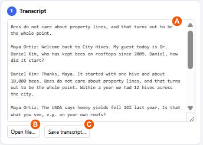
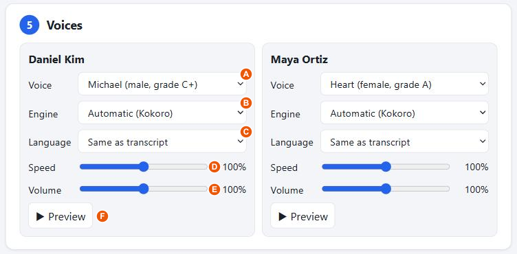
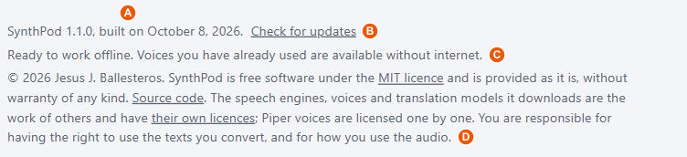

# SynthPod user manual

SynthPod turns a written conversation (a podcast transcript, an interview, a panel discussion) into a single MP3 file in which every speaker has their own voice.

It runs entirely in your web browser. There is nothing to install, no account, and your transcript is never uploaded anywhere.

**Open the app: <https://jesusjballesteros.github.io/synthpod/>**

> **How to read this manual.** The orange letters in each picture mark the controls. The table under the picture has the same letters in its first column, so you can go from what you see to what it does. The blue numbers belong to the app itself: they are its seven steps.

<!--
The pictures in docs/images are made from the plain screenshots in docs/images/raw by
scripts/annotate-screenshots.mjs, which holds the position of every letter. Between them they cover
the wide, narrow and phone layouts, the light and dark themes, and the English and Spanish
interfaces, with an invented sample transcript. When a table here changes, change the letters there.
-->

## Contents

- [Quick start](#quick-start)
- [The page at a glance](#the-page-at-a-glance)
- [1. Transcript](#1-transcript)
- [2. Check the text](#2-check-the-text)
- [3. What was found](#3-what-was-found)
- [Translate (optional)](#translate-optional)
- [4. Language and engine](#4-language-and-engine)
- [5. Voices](#5-voices)
- [6. Output settings](#6-output-settings)
- [7. Render](#7-render)
- [Using it without internet](#using-it-without-internet)
- [What you need](#what-you-need)
- [Troubleshooting](#troubleshooting)
- [Privacy](#privacy)
- [Licence and credits](#licence-and-credits)

## Quick start

1. Open the app in Chrome, Edge, Brave or Firefox.
2. Paste your transcript into the box, or drop a file onto it.
3. Step through the numbers and other items the app flags, and fix the ones that would be read oddly.
4. Check the summary of speakers and the language.
5. Pick a voice for each speaker. Press **Preview** to hear it.
6. Press **Render MP3**, wait, then press **Save MP3…**.

The page reloads itself once on your very first visit. That is normal: it switches on the fast rendering mode.

## The page at a glance

The work is split into seven numbered steps. You go through them in order, but nothing is locked: you can go back and change anything at any time.

On a wide screen (the picture at the top) the steps sit in two columns. On a narrow screen or a phone, the two columns become two stages, and you switch between them with the buttons under the title (**F** below).

| The Text stage on a phone: dark theme, Spanish interface | The Audio stage on a phone: dark theme, English interface |
|---|---|
|  |  |

| | Part of the page | What it is for |
|:-:|---|---|
| **A** | The text column: steps 1 to 3 | Everything about the words: the transcript, the check for items that may be read oddly, and what the app found in it. |
| **B** | The audio column: steps 4 to 7 | Everything about the sound: language, voices, settings, and the render itself. |
| **C** | **Translate (optional)** | A card that opens when you click it. On a wide screen it is at the top right; on a narrow one it is at the end of the text stage. |
| **D** | **Appearance** | Light, dark, or follow your system setting. |
| **E** | **Interface language** | The language of the app itself: English, Spanish or German. It starts in your browser's language when that is one of the three. This is separate from the language of your transcript. |
| **F** | **1 · Text** / **2 · Audio** | Narrow screens only: show the text steps or the audio steps. **Continue to audio →** at the end of the text stage does the same. |

## 1. Transcript

| | Control | What it does |
|:-:|---|---|
| **A** | **Transcript box** | Paste your text here, or drop a file onto it. You can edit the text freely; everything else updates as you type. |
| **B** | **Open file…** | Choose a file instead. These types work: `.txt`, `.md`, `.docx`, `.srt`, `.vtt` and `.pdf`. The MP3 is later named after the file. |
| **C** | **Save transcript…** | Stores the text as it now stands in the box, as a `.txt` file: with your corrections, or translated. After a translation the file name gets the language added, for example `interview (es).txt`. |

The app needs to know who is speaking. It recognises the usual ways of writing that down:

| Style | Example |
|---|---|
| Name and text on one line | `Anna: Welcome back to the show.` |
| Name on its own line | `ANNA:` then the text on the next line |
| Bold, brackets or a dash | `**Anna:** …`, `[Anna] …`, `Anna — …` |
| With a timecode | `[00:12:03] Anna: …` |
| Interview initials | `Q:` / `A:`, `I:` / `B:` |
| Subtitle files | `<v Anna>…</v>` in `.vtt` files |

A name counts as a speaker only if it appears more than once, so a stray "Note:" in the text is not mistaken for a person.

### Papers and other documents without speakers (PDF)

Open a `.pdf` such as a research paper, an essay or a report, and the app treats it as running text for a single voice. There is one voice card, called **Reader**, already set to the language of the document; pick the voice you like and render as usual.

To make the result pleasant to listen to, the app leaves out what a listener does not need, where it can recognise it:

- page headers and footers, and page numbers;
- footnotes at the foot of the page, and the small raised numbers that point to them or to the references;
- notes printed in the margin beside the text, such as a glossary or the authors' addresses;
- figure captions, tables and boxes set in smaller print, when they carry a label such as "Fig. 2", "Table 1" or "Box 3";
- small print above the start of the text on the first page, such as a copyright notice;
- the list of references at the end, and everything after it.

It also joins the lines of each paragraph, rejoins words split at the end of a line, and reads a page with two columns one column after the other.

**Sections become chapters.** The app marks each section heading with `##` at the start of its line, as in `## Methods`. Every marked heading starts a chapter in the MP3, named after the heading, so a long paper can be navigated in a podcast player. The headings are found in one of two ways:

- from the document's own outline (the bookmarks some PDFs carry), when it has one;
- otherwise by their look: a short line on its own that is written in capitals, set in larger type or in a different typeface from the text (bold, for instance), or starts with a section number such as `2.1`.

You are in control of the result: add `## ` in front of any line to make it a chapter, or delete the marks from a line that is not really a heading. The marks themselves are not read aloud. A heading in capitals is read as an ordinary phrase, with a pause after it.

These are educated guesses, so check the text in the box before rendering: delete anything that slipped through, such as a table without a label or the authors' names under the title. A box of side text in a magazine-style paper is left out along with the figures, so paste it in by hand if you want it read. Only PDFs that contain real text work; a scanned document is a picture of text and comes out empty.

Any other text without speakers can be read the same way: under **Reading options** in step 2, set **Speaker label format** to **No speakers: one voice reads everything**. Lines starting with `## ` make chapters there too.

## 2. Check the text

Voices can stumble over numbers, abbreviations, words in capitals and web addresses. This step sits right under the transcript, so you can see both at once: it counts those items and lets you go through them one at a time.

| | Control | What it does |
|:-:|---|---|
| **A** | **All**, **Numbers**, **Abbreviations**, **Capitals**, **Web addresses** | Choose which kind of item to step through. The number is how many there are. |
| **B** | **◀ Previous** / **Next ▶** | Go to the previous or next item. It is selected in the transcript box, and the box scrolls to it, so you can rewrite it on the spot (for example "1999" as "nineteen ninety-nine"). |
| **C** | The line with the highlighted item | Shows the item with the words around it. Click it to jump to that place again. |
| **D** | "With the current settings this is read as…" | Appears when the pronunciation settings already change how the item is read. In the picture, "14%" will be read as "14 percent" and "e.g." as "for example". |
| **E** | **Add to word list** | Puts the item into your pronunciation list in step 6 and takes you there to type how it should be said. |
| **F** | **Reading options** | Opens the settings below. You only need them if the app misreads your transcript. |
| **G** | Speaker label format | Tell the app which way the speakers are written, if its guess is wrong, or that there are no speakers at all. |
| **H** | Expected speakers | How many people speak. Leave it at 0 to let the app decide. |
| **I** | Remove timecodes | On by default. Removes marks such as `[00:12:03]`. |
| **J** | Remove stage directions | On by default. Removes notes such as `(laughs)` or `[inaudible]`. Ordinary brackets in a sentence are kept. |

When you are happy with the text, **Save transcript…** in step 1 keeps a copy of it.

## 3. What was found

The first lines (**A**) sum up the transcript: speakers, turns, words, the estimated length of the audio, how the speakers were written, and the language the app detected. You do not need to look further unless something is wrong.

**Speakers and details** holds the rest. It opens by itself when the app needs a decision from you, such as two names that look like the same person, or text with no speaker.

| | Control | What it does |
|:-:|---|---|
| **B** | **Speaker name** | Edit it to rename the speaker everywhere. |
| **C** | **likely host** | A hint only: this person speaks first or asks most of the questions. |
| **D** | Turns, Words, Share of talk | How much each person says. |
| **E** | **Merge into…** | The last column of the table; on a narrow screen, slide the table sideways to reach it, as in the picture. Joins this speaker with another one, when the same person was written in two ways. When two names look alike ("Weber" and "Anna Weber") the app also offers a one-press **Merge**. |
| **F** | **Unlabelled text … is spoken by** | Text with no name in front of it, such as a teaser before the introduction. Give it to a speaker or keep it as a separate voice. If the same words appear later in someone's turn, that speaker is suggested, as in the picture. |
|  | **Undo all speaker edits** | Appears after you rename, merge or assign. Returns to what the app first detected. |

## Translate (optional)

Open the **Translate (optional)** card to turn the transcript into another language before making the audio, for example an English interview into Spanish.

1. **From** (**A**) is the language set in step 4. Choose the **To** language (**B**) and press **Translate** (**C**).
2. A review window opens with every turn next to its translation. Correct the right-hand side where needed.
3. Press **Use this translation**. It replaces the transcript, the language switches, and voices for the new language are offered. **Save transcript…** in step 1 then stores the translated text.

| | Control | What it does |
|:-:|---|---|
| **A** | **From** | The language of the transcript, as set in step 4. |
| **B** | **To** | The target language. Languages with a direct translation model come first. |
| **C** | **Translate** / **Cancel** | Starts or stops the translation. A progress bar shows how far it is. |
| **D** | The status line | Says what is happening: downloading the model, how many sentences are done, or that the translation is ready. |
| **E** | **Review the translation** | Opens the review window again if you closed it. Your corrections are kept. |
| | **Go back to the original** | Appears after you used a translation. Restores the transcript you started with. |

| | Control | What it does |
|:-:|---|---|
| **A** | **Original** | Each turn of your transcript, with the speaker's name above it. It cannot be edited here. |
| **B** | **Translation** | The same turn translated. Click into a box and correct it. |
| **C** | **Use this translation** | Replaces the transcript with the corrected translation. |
| **D** | **Close** | Closes the window without using the translation. It is kept, so you can open it again. |

The translation is done on your computer and nothing is uploaded, but its quality is below that of online translators, so do not skip the review. It is best suited to short transcripts. The first time you use a language pair, a model of about 110 MB is downloaded. Some pairs have no direct model and are translated through English, which takes two downloads and is a little less accurate. A 5,500-word transcript takes a few minutes on a recent laptop.

If you need a polished translation and the text is not confidential, translating it with an online service and pasting the result in works just as well.

## 4. Language and engine

| | Control | What it does |
|:-:|---|---|
| **A** | **Language** | The language the transcript is spoken in. The app detects it; change it if it is wrong. It decides which voices are offered. |
| **B** | **Engine** | The program that produces the speech. "Automatic" picks Kokoro for English and Piper for every other language. |
| **C** | **Hardware, software and expected rendering times** | Opens the panel in the picture. |
| **D** | "This device: …" | Describes your own computer as the browser reports it: processor threads, memory, whether the graphics card can be used, and whether multi-threading is on. |

The two engines:

| | Piper | Kokoro |
|---|---|---|
| Languages | About 40 | English only |
| Sound | Good, slightly synthetic | More natural |
| Speed | Fast | Much slower |
| Download | 20 to 110 MB per voice | 90 to 330 MB, once |

For a long English transcript on an ordinary laptop, Piper is the practical choice.

## 5. Voices

Each speaker has a card with the same controls; the letters are on the first one. The app gives every speaker a different voice to start with.

| | Control | What it does |
|:-:|---|---|
| **A** | **Voice** | The voice for this speaker. The list shows what is known about each voice, such as gender and quality. |
| **B** | **Engine** | Only needed if this speaker should use a different engine from the rest. |
| **C** | **Language** | Only needed if this speaker talks in a different language from the rest of the transcript. |
| **D** | **Speed** | 70% to 130% of the voice's normal pace. |
| **E** | **Volume** | 50% to 150%. Loudness is evened out automatically (see step 6), so use this only to make someone deliberately louder or quieter. |
| **F** | **▶ Preview** | Plays this speaker's first sentence with the current settings. |

The first time you use a voice it is downloaded, which can take a moment. After that it is kept on your computer. Your choice is remembered by speaker name, so a returning host keeps their voice.

## 6. Output settings

The defaults suit most transcripts. Everything here is remembered in your browser.

### Style and pauses

| | Control | What it does |
|:-:|---|---|
| **A** | **Voices** | *A different voice for each speaker* (the default); *different voices, each introduced by name once*; or *one narrator who names each speaker*, which is useful when a language has only one voice. |
| **B** | **Narrator says** | Only for the narrator: "Anna says:" or just "Anna:". It is greyed out in the other two modes. |
| **C** | **Pause between speakers** | Silence when the speaker changes, in milliseconds. |
| **D** | **between paragraphs** | Silence at a blank line within one person's turn. |
| **E** | **after the opening teaser** | A longer pause after text that comes before the first named speaker. 0 means no special pause. |

### Pronunciation

| | Control | What it does |
|:-:|---|---|
| **F** | **Read abbreviations, symbols and web addresses in full** | "e.g." becomes "for example", "20 %" becomes "20 percent", and a web address is shortened to the name of the site. Works for English, German, Spanish and French. |
| **G** | **Word list** | Your own corrections. Type a word as it is **written** on the left and how to **say** it on the right, for example `USDA` → `U S D A`. It applies to whole words, in upper or lower case. |
| **H** | **Add a word** / **Remove** | Add or delete a line of the list. |

### Sound and file

| | Control | What it does |
|:-:|---|---|
| **I** | **Even out the speakers and set the loudness** | Brings every voice to the same level, and the whole file to the level given in LUFS. −16 is the usual level for podcasts. |
| **J** | **Quality** | The MP3 bitrate. Higher means a larger file; 128 kbps is plenty for speech. |
| **K** | **Channels** | Mono is the right choice for speech. Stereo puts the same sound on both sides, for players that require it. |
| **L** | **Sample rate** | Leave it on "Same as the voices" unless a player needs a specific rate. |
| **M** | **Add chapter markers** | Stores one chapter per speaker turn in the MP3, titled with the speaker and their first words. For a document without speakers, there is one chapter per section, titled with its heading. Players that support MP3 chapters use them to show a list of sections; many podcast apps do, and some general players do not. |

### File information and presets

| | Control | What it does |
|:-:|---|---|
| **A** | **Title**, **Artist**, **Comment** | Text stored in the MP3 and shown by music players. Title defaults to the file name, and Artist to the speakers' names. |
| **B** | **Saved presets** / **Load** / **Delete** | A preset holds all the settings of this step together with the voice chosen for each speaker name. Pick one and load it, or delete it. |
| **C** | **Save current settings** | Stores the current state as a preset under the name you type. |
| **D** | **Restore the defaults** | Resets every setting of this step. |

## 7. Render

| | Control | What it does |
|:-:|---|---|
| **A** | **Render MP3** | Starts producing the audio. |
| **B** | **Cancel** | Shown while rendering. It stops at once, and the finished part is kept, so rendering again continues where it stopped. |
| **C** | The progress bar | Shows how far the render is. |
| **D** | The status line | Says which sentence is being produced and roughly how long is left. The first time a voice is used, it reports the download here. |

If you change one speaker's voice and render again, only that speaker is rendered; everything else is reused.

| | Control | What it does |
|:-:|---|---|
| **A** | **Save MP3…** | Stores the finished file on your computer. |
| **B** | **Save captions (.srt)** / **(.vtt)** | Stores the text with its exact timings. `.srt` is the most widely supported subtitle format; `.vtt` is for web video players. |
| **C** | **Save chapters (.cue)** | Stores a small "cue sheet" that lists the chapters. Use it with players that do not show the chapters inside an MP3, such as VLC: save the MP3 first, keep the `.cue` file in the same folder under the same name, and open the `.cue` file instead of the MP3. The player then shows the chapters as a list. |
| **D** | **Clear render cache** | Deletes the audio kept for fast re-rendering, to free disk space. |
| **E** | The size note | How much disk space that kept audio takes up at the moment. It is brought up to date when a render or a preview ends. |
| **F** | The status line | The length of the finished audio and the size of the MP3. If sentences had to be left out, it says how many. |
| **G** | The player | Listen to the result in the page before saving. |

## Using it without internet

After your first visit the app keeps a copy of itself in the browser. A note at the bottom of the page (**C**) says when it is "Ready to work offline". From then on it opens without a connection, and every voice you have already used keeps working. Voices and translation models you have never used still need internet once, to download.

In Chrome, Edge and Brave you can also install it like a program: use the install icon in the address bar, or the browser menu → "Install SynthPod".

### Staying up to date

The bottom of the page shows the version you are running and the date it was built (**A**). The app normally updates itself whenever you open it with an internet connection. **Check for updates** (**B**) asks straight away: if there is a newer version the page reloads into it, and otherwise it tells you that you have the latest one. Your settings, voices and saved audio are kept.

## What you need

- **Browser:** a current Chrome, Edge, Brave or Firefox, on Windows, macOS or Linux. The app has been tested in all four and works well in each. Safari has not been tested; see the notes below.
- **Memory:** 8 GB recommended (4 GB is enough for short transcripts with Piper; 16 GB for Kokoro or recordings over an hour).
- **Internet:** only for downloading voices the first time.

Measured time to render 30 minutes of audio, on a recent laptop with a 16-thread processor and integrated graphics:

| | Piper | Kokoro |
|---|---|---|
| Using all processor threads | about 2 to 3 min | about 25 min |
| Limited to one thread | about 10 min | about 50 min |

Other computers will differ: Piper scales with the number of processor cores, and Kokoro with the graphics card.

Differences between browsers:

- **Firefox** works in every respect. Files are saved through the normal download prompt instead of a "Save as" window, and Kokoro uses the graphics card only where Firefox supports WebGPU.
- **Safari** has not been tested and is the least certain. It would run on a single processor thread, so rendering would be several times slower, and it may download voices again on each visit because it cannot store them the same way.
- **Linux** with Chrome usually has WebGPU switched off, so Kokoro runs on the processor there; Piper is unaffected.

## Troubleshooting

- **No speakers were found.** Check that names are followed by a colon, or pick the label style under **Reading options** in step 2.
- **A PDF comes out empty or jumbled.** It is probably a scan (pictures of pages), or has an unusual layout, such as three or more columns or text wrapped around pictures, that the app could not follow. Copy the text from your PDF reader and paste it instead.
- **Too many speakers were found.** Set **Expected speakers**, or merge the extra ones.
- **The Render button is greyed out.** Choose a language; every speaker needs a voice.
- **Some sentences were left out.** The status line says how many. Press **Render MP3** again; only the missing ones are retried.
- **A word is pronounced wrongly.** Use step 2 to find it, then rewrite it the way it sounds or add it to your word list.
- **Rendering is very slow.** Switch the engine to Piper.
- **"Starting the speech engine…" stays for a long time.** In some browsers the engine's extra processor threads fail to start. After 40 seconds the app notices, continues on a single thread and remembers that for next time. Rendering then works, but several times slower; the hardware panel in step 4 says when this has happened.
- **A preview or render seems stuck for another reason.** If the speech engine stops answering, the app says so after a couple of minutes and restarts it; press the button again. If it keeps happening, close other heavy tabs: translation and Kokoro both use a lot of memory.
- **"Downloading … voice model" appears in the middle of a render.** That is normal: each voice is loaded the first time one of its sentences comes up.
- **No chapters show in my player.** The chapters are inside the MP3, but several common players, VLC and Windows Media Player among them, do not display chapters from MP3 files. Press **Save chapters (.cue)** in step 7 and open that file in the player instead, or listen in a podcast app, which does show them. In VLC the cue sheet gives one playlist entry per chapter that you can step through with Next and Previous, but VLC labels every entry with the title of the MP3 rather than the chapter title. If you rename or move the MP3, the `.cue` file must be renamed and moved with it.

## Privacy

Your transcript stays on your computer. The only things downloaded are the app itself, the voices and the translation models (from Hugging Face; Kokoro also fetches its runtime from jsDelivr).

## Licence and credits

SynthPod is free software under the [MIT licence](LICENSE), © 2026 Jesus J. Ballesteros, provided as it is, without warranty. You are responsible for having the right to use the texts you convert, and for how you use the audio. A short form of this notice is at the bottom of the app (**D** in the picture of the footer).

The app is built on the work of others, each under its own licence:

| Component | What it does here | Licence |
|---|---|---|
| [Piper](https://github.com/rhasspy/piper) voices, from [rhasspy/piper-voices](https://huggingface.co/rhasspy/piper-voices) | The voices for about 40 languages | One licence per voice; see the note below |
| [piper-wasm](https://github.com/diffusion-studio/piper-wasm) with [espeak-ng](https://github.com/espeak-ng/espeak-ng) | Turns text into speech sounds for Piper | MIT; espeak-ng itself is GPL-3.0 |
| [onnxruntime-web](https://github.com/microsoft/onnxruntime) | Runs the voice models | MIT |
| [kokoro-js](https://github.com/hexgrad/kokoro) and the Kokoro-82M model | The Kokoro engine and its voices | Apache-2.0 |
| [Opus-MT](https://github.com/Helsinki-NLP/Opus-MT) models | Translation | CC-BY-4.0 |
| [transformers.js](https://github.com/huggingface/transformers.js) | Runs the translation models | Apache-2.0 |
| [@breezystack/lamejs](https://github.com/shijinyu/lamejs) | Encodes the MP3 | LGPL-3.0 |
| [browser-id3-writer](https://github.com/egoroof/browser-id3-writer) | Writes title, artist and chapters into the MP3 | MIT |
| [mammoth](https://github.com/mwilliamson/mammoth.js) | Reads `.docx` files | BSD-2-Clause |
| [pdf.js](https://github.com/mozilla/pdf.js) | Reads `.pdf` files | Apache-2.0 |
| [franc](https://github.com/wooorm/franc) | Detects the language of the transcript | MIT |

espeak-ng (GPL-3.0) and the MP3 encoder (LGPL-3.0) are not built into the app's own code: each is used as a separate, unmodified file that can be replaced.

**Piper voices are licensed one by one.** Some were trained on recordings that restrict commercial use. Before you use a voice's audio commercially, read its `MODEL_CARD` in [rhasspy/piper-voices](https://huggingface.co/rhasspy/piper-voices).
