# SynthPod user manual

SynthPod turns a written conversation (a podcast transcript, an interview, a panel discussion) into a single MP3 file in which every speaker has their own voice.

It runs entirely in your web browser. There is nothing to install, no account, and your transcript is never uploaded anywhere.

**Open the app: <https://jesusjballesteros.github.io/synthpod/>**

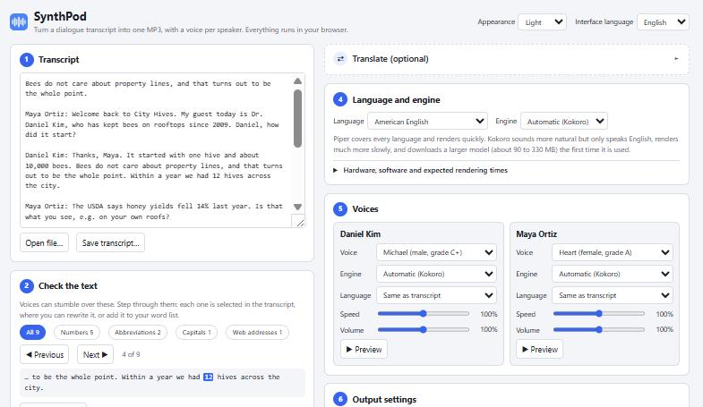

<!--
Screenshots are in docs/images/. Each view is shown once, and between them they cover the wide,
narrow and phone layouts, the light and dark themes, and the English and Spanish interfaces.
They use an invented sample transcript. Retake the affected ones whenever the layout changes.
-->

## Contents

- [Quick start](#quick-start)
- [The page at a glance](#the-page-at-a-glance)
- [1. Transcript](#1-transcript)
- [2. Check the text](#2-check-the-text)
- [3. What was found](#3-what-was-found)
- [Translate (optional)](#translate-optional)
- [4. Language and engine](#4-language-and-engine)
- [5. Voices](#5-voices)
- [6. Output settings](#6-output-settings)
- [7. Render](#7-render)
- [Using it without internet](#using-it-without-internet)
- [What you need](#what-you-need)
- [Troubleshooting](#troubleshooting)
- [Privacy](#privacy)

## Quick start

1. Open the app in Chrome, Edge or Brave.
2. Paste your transcript into the box, or drop a file onto it.
3. Step through the numbers and other items the app flags, and fix the ones that would be read oddly.
4. Check the list of speakers and the language.
5. Pick a voice for each speaker. Press **Preview** to hear it.
6. Press **Render MP3**, wait, then press **Save MP3…**.

The page reloads itself once on your very first visit. That is normal: it switches on the fast rendering mode.

## The page at a glance

The work is split into seven numbered steps. On a wide screen (the picture above) they sit in two columns: the text on the left (steps 1 to 3) and the audio on the right (steps 4 to 7), with the optional translation at the top right.

On a narrow screen or a phone, the two columns become two stages. The buttons under the title switch between them, and **Continue to audio →** at the end of the text stage does the same. There, the translation sits at the end of the text stage.

| The Text stage on a phone: dark theme, Spanish interface | The Audio stage on a phone: dark theme, English interface |
|---|---|
| 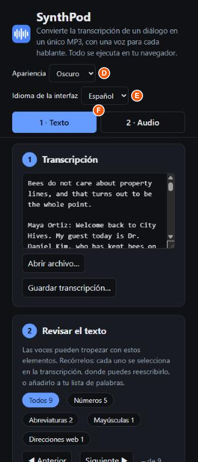 | 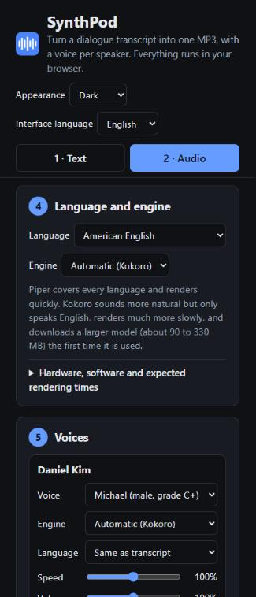 |

| Control | What it does |
|---|---|
| **Appearance** | Light, dark, or follow your system setting. |
| **Interface language** | The language of the app itself: English, Spanish or German. It starts in your browser's language when that is one of the three. This is separate from the language of your transcript. |
| **1 · Text** / **2 · Audio** | Narrow screens only: show the text steps or the audio steps. |

## 1. Transcript

The transcript box is the first thing in every picture above.

| Control | What it does |
|---|---|
| **Transcript box** | Paste your text here, or drop a file onto it. You can edit the text freely; everything else updates as you type. |
| **Open file…** | Choose a file instead. These types work: `.txt`, `.md`, `.docx`, `.srt`, `.vtt` and `.pdf`. The MP3 is later named after the file. |
| **Save transcript…** | Stores the text as it now stands in the box, as a `.txt` file: with your corrections, or translated. After a translation the file name gets the language added, for example `interview (es).txt`. |

The app needs to know who is speaking. It recognises the usual ways of writing that down:

| Style | Example |
|---|---|
| Name and text on one line | `Anna: Welcome back to the show.` |
| Name on its own line | `ANNA:` then the text on the next line |
| Bold, brackets or a dash | `**Anna:** …`, `[Anna] …`, `Anna — …` |
| With a timecode | `[00:12:03] Anna: …` |
| Interview initials | `Q:` / `A:`, `I:` / `B:` |
| Subtitle files | `<v Anna>…</v>` in `.vtt` files |

A name counts as a speaker only if it appears more than once, so a stray "Note:" in the text is not mistaken for a person.

### Papers and other documents without speakers (PDF)

Open a `.pdf` such as a research paper, an essay or a report, and the app treats it as running text for a single voice. There is one voice card, called **Reader**, already set to the language of the document; pick the voice you like and render as usual.

To make the result pleasant to listen to, the app leaves out what a listener does not need, where it can recognise it:

- page headers and footers that repeat on most pages, and page numbers;
- footnotes at the foot of the page, and the small raised numbers that point to them;
- small print above the start of the text on the first page, such as a copyright notice.

It also joins the lines of each paragraph and rejoins words split at the end of a line.

**Sections become chapters.** The app marks each section heading with `##` at the start of its line, as in `## Methods`. Every marked heading starts a chapter in the MP3, named after the heading, so a long paper can be navigated in a podcast player. The headings are found in one of two ways:

- from the document's own outline (the bookmarks some PDFs carry), when it has one;
- otherwise by their look: a short line on its own that is written in capitals, set in larger type, or starts with a section number such as `2.1`.

You are in control of the result: add `## ` in front of any line to make it a chapter, or delete the marks from a line that is not really a heading. The marks themselves are not read aloud. A heading in capitals is read as an ordinary phrase, with a pause after it.

These are educated guesses, so check the text in the box before rendering: delete anything that slipped through, such as a table, a figure caption or a list of references. Only PDFs that contain real text work; a scanned document is a picture of text and comes out empty.

Any other text without speakers can be read the same way: under **Reading options** in step 2, set **Speaker label format** to **No speakers: one voice reads everything**. Lines starting with `## ` make chapters there too.

## 2. Check the text

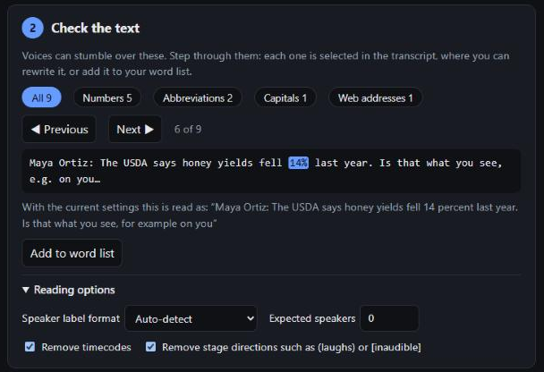

Voices can stumble over numbers, abbreviations, words in capitals and web addresses. This step sits right under the transcript, so you can see both at once: it counts those items and lets you go through them one at a time.

| Control | What it does |
|---|---|
| **All**, **Numbers**, **Abbreviations**, **Capitals**, **Web addresses** | Choose which kind of item to step through. The number is how many there are. |
| **◀ Previous** / **Next ▶** | Go to the previous or next item. It is selected in the transcript box, and the box scrolls to it, so you can rewrite it on the spot (for example "1999" as "nineteen ninety-nine"). |
| The line with the highlighted item | Shows the item with the words around it. Click it to jump to that place again. |
| "With the current settings this is read as…" | Appears when the pronunciation settings already change how the item is read. In the picture, "14%" will be read as "14 percent" and "e.g." as "for example". |
| **Add to word list** | Puts the item into your pronunciation list in step 6 and takes you there to type how it should be said. |
| **Reading options** | Opens the settings below. You only need them if the app misreads your transcript. |
| Speaker label format | Tell the app which way the speakers are written, if its guess is wrong, or that there are no speakers at all. |
| Expected speakers | How many people speak. Leave it at 0 to let the app decide. |
| Remove timecodes | On by default. Removes marks such as `[00:12:03]`. |
| Remove stage directions | On by default. Removes notes such as `(laughs)` or `[inaudible]`. Ordinary brackets in a sentence are kept. |

When you are happy with the text, **Save transcript…** in step 1 keeps a copy of it.

## 3. What was found

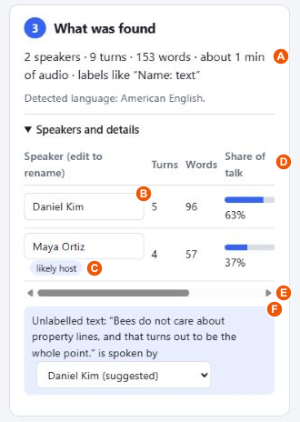

The first line sums up the transcript: speakers, turns, words, the estimated length of the audio, and how the speakers were written. Below it the app says which language it detected. You do not need to look further unless something is wrong.

**Speakers and details** holds the rest. It opens by itself when the app needs a decision from you, such as two names that look like the same person, or text with no speaker.

| Control | What it does |
|---|---|
| **Speaker name** | Edit it to rename the speaker everywhere. |
| **likely host** | A hint only: this person speaks first or asks most of the questions. |
| Turns, Words, Share of talk | How much each person says. On a narrow screen, slide the table sideways to reach **Merge into…**. |
| **Merge into…** | Joins this speaker with another one, when the same person was written in two ways. When two names look alike ("Weber" and "Anna Weber") the app also offers a one-press **Merge**. |
| **Unlabelled text … is spoken by** | Text with no name in front of it, such as a teaser before the introduction. Give it to a speaker or keep it as a separate voice. If the same words appear later in someone's turn, that speaker is suggested, as in the picture. |
| **Undo all speaker edits** | Appears after you rename, merge or assign. Returns to what the app first detected. |

## Translate (optional)

Open the **Translate (optional)** card to turn the transcript into another language before making the audio, for example an English interview into Spanish.

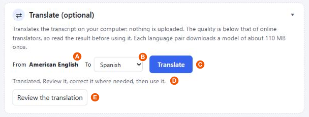

1. **From** is the language detected in step 4. Choose the **To** language and press **Translate**.
2. A review window opens with every turn next to its translation. Correct the right-hand side where needed.
3. Press **Use this translation**. It replaces the transcript, the language switches, and voices for the new language are offered. **Save transcript…** in step 1 then stores the translated text.

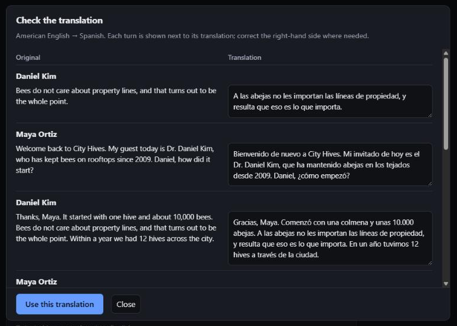

| Control | What it does |
|---|---|
| **To** | The target language. Languages with a direct translation model come first. |
| **Translate** / **Cancel** | Starts or stops the translation. A progress bar shows how far it is. |
| **Review the translation** | Opens the review window again if you closed it. Your corrections are kept. |
| **Use this translation** | Replaces the transcript with the corrected translation. |
| **Close** | Closes the window without using the translation. |
| **Go back to the original** | Appears after you used a translation. Restores the transcript you started with. |

The translation is done on your computer and nothing is uploaded, but its quality is below that of online translators, so do not skip the review. It is best suited to short transcripts. The first time you use a language pair, a model of about 110 MB is downloaded. Some pairs have no direct model and are translated through English, which takes two downloads and is a little less accurate. A 5,500-word transcript takes a few minutes on a recent laptop.

If you need a polished translation and the text is not confidential, translating it with an online service and pasting the result in works just as well.

## 4. Language and engine

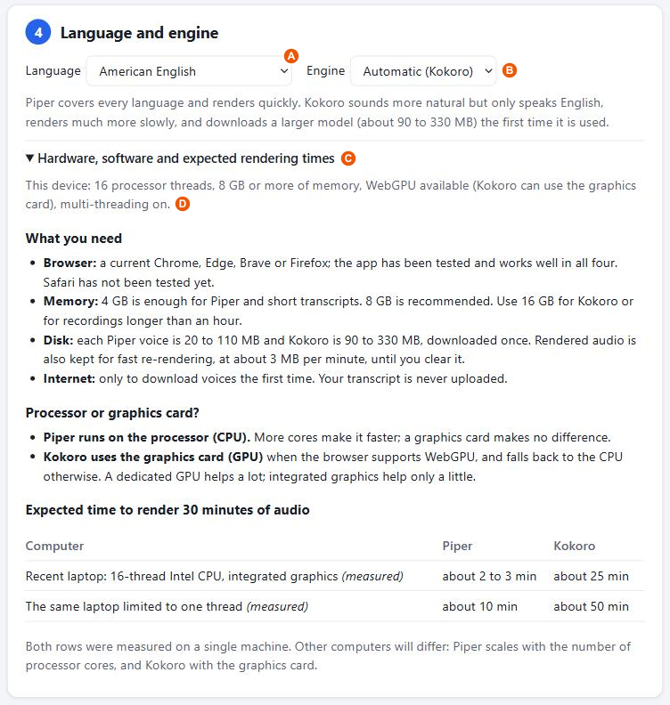

| Control | What it does |
|---|---|
| **Language** | The language the transcript is spoken in. The app detects it; change it if it is wrong. It decides which voices are offered. |
| **Engine** | The program that produces the speech. "Automatic" picks Kokoro for English and Piper for every other language. |
| **Hardware, software and expected rendering times** | Opens the panel in the picture. Its first line describes your own computer as the browser reports it, including whether multi-threading is on. |

The two engines:

| | Piper | Kokoro |
|---|---|---|
| Languages | About 40 | English only |
| Sound | Good, slightly synthetic | More natural |
| Speed | Fast | Much slower |
| Download | 20 to 110 MB per voice | 90 to 330 MB, once |

For a long English transcript on an ordinary laptop, Piper is the practical choice.

## 5. Voices

Each speaker has a card. The wide picture at the top shows two of them side by side; on a phone they are stacked, as in the Audio-stage picture. The app gives every speaker a different voice to start with.

| Control | What it does |
|---|---|
| **Voice** | The voice for this speaker. The list shows what is known about each voice, such as gender and quality. |
| **Engine** | Only needed if this speaker should use a different engine from the rest. |
| **Language** | Only needed if this speaker talks in a different language from the rest of the transcript. |
| **Speed** | 70% to 130% of the voice's normal pace. |
| **Volume** | 50% to 150%. Loudness is evened out automatically (see step 6), so use this only to make someone deliberately louder or quieter. |
| **▶ Preview** | Plays this speaker's first sentence with the current settings. |

The first time you use a voice it is downloaded, which can take a moment. After that it is kept on your computer. Your choice is remembered by speaker name, so a returning host keeps their voice.

## 6. Output settings

The defaults suit most transcripts. Everything here is remembered in your browser.

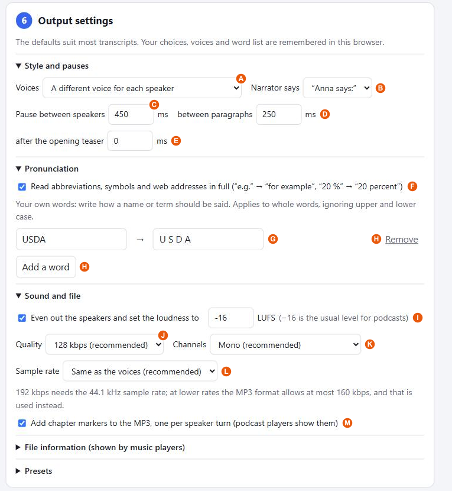

### Style and pauses

| Control | What it does |
|---|---|
| **Voices** | *A different voice for each speaker* (the default); *different voices, each introduced by name once*; or *one narrator who names each speaker*, which is useful when a language has only one voice. |
| **Narrator says** | Only for the narrator: "Anna says:" or just "Anna:". It is greyed out in the other two modes. |
| **Pause between speakers** | Silence when the speaker changes, in milliseconds. |
| **between paragraphs** | Silence at a blank line within one person's turn. |
| **after the opening teaser** | A longer pause after text that comes before the first named speaker. 0 means no special pause. |

### Pronunciation

| Control | What it does |
|---|---|
| **Read abbreviations, symbols and web addresses in full** | "e.g." becomes "for example", "20 %" becomes "20 percent", and a web address is shortened to the name of the site. Works for English, German, Spanish and French. |
| **Word list** | Your own corrections. Type a word as it is **written** on the left and how to **say** it on the right, for example `USDA` → `U S D A`. It applies to whole words, in upper or lower case. |
| **Add a word** / **Remove** | Add or delete a line of the list. |

### Sound and file

| Control | What it does |
|---|---|
| **Even out the speakers and set the loudness** | Brings every voice to the same level, and the whole file to the level given in LUFS. −16 is the usual level for podcasts. |
| **Quality** | The MP3 bitrate. Higher means a larger file; 128 kbps is plenty for speech. |
| **Channels** | Mono is the right choice for speech. Stereo puts the same sound on both sides, for players that require it. |
| **Sample rate** | Leave it on "Same as the voices" unless a player needs a specific rate. |
| **Add chapter markers** | Stores one chapter per speaker turn in the MP3, titled with the speaker and their first words. For a document without speakers, there is one chapter per section, titled with its heading. Players that support MP3 chapters use them to show a list of sections; many podcast apps do, and some general players do not. |

### File information and presets

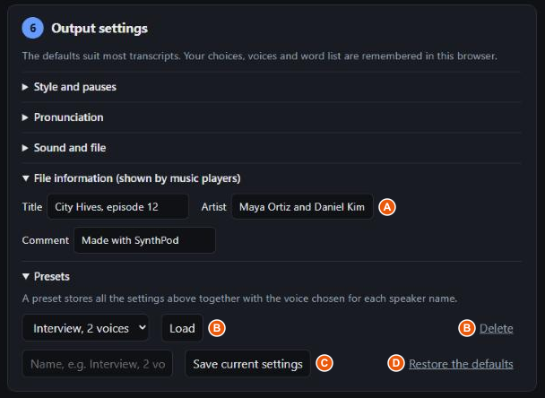

| Control | What it does |
|---|---|
| **Title**, **Artist**, **Comment** | Text stored in the MP3 and shown by music players. Title defaults to the file name, and Artist to the speakers' names. |
| **Saved presets** / **Load** / **Delete** | A preset holds all the settings of this step together with the voice chosen for each speaker name. Pick one and load it, or delete it. |
| **Save current settings** | Stores the current state as a preset under the name you type. |
| **Restore the defaults** | Resets every setting of this step. |

## 7. Render

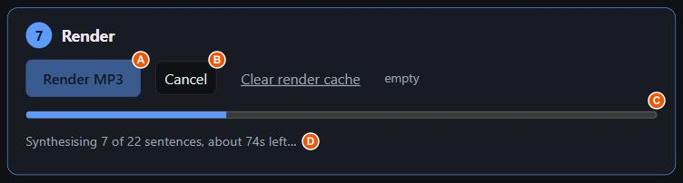

| Control | What it does |
|---|---|
| **Render MP3** | Starts producing the audio. A progress bar shows how far it is and roughly how long is left. |
| **Cancel** | Shown while rendering. It stops at once, and the finished part is kept, so rendering again continues where it stopped. |

If you change one speaker's voice and render again, only that speaker is rendered; everything else is reused.

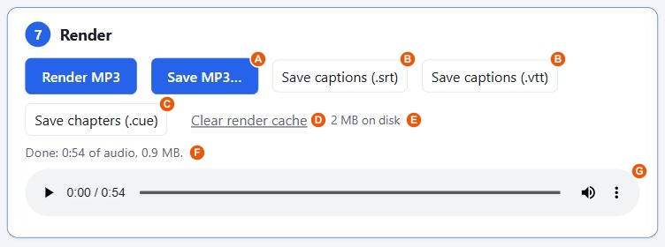

| Control | What it does |
|---|---|
| **Save MP3…** | Stores the finished file on your computer. |
| **Save captions (.srt)** / **(.vtt)** | Stores the text with its exact timings. `.srt` is the most widely supported subtitle format; `.vtt` is for web video players. |
| **Save chapters (.cue)** | Stores a small "cue sheet" that lists the chapters. Use it with players that do not show the chapters inside an MP3, such as VLC: save the MP3 first, keep the `.cue` file in the same folder under the same name, and open the `.cue` file instead of the MP3. The player then shows the chapters as a list. |
| **Clear render cache** | Deletes the audio kept for fast re-rendering, to free disk space. |
| The player | Listen to the result in the page before saving. |

## Using it without internet

After your first visit the app keeps a copy of itself in the browser. A note at the bottom of the page says when it is "Ready to work offline". From then on it opens without a connection, and every voice you have already used keeps working. Voices and translation models you have never used still need internet once, to download.

In Chrome, Edge and Brave you can also install it like a program: use the install icon in the address bar, or the browser menu → "Install SynthPod".

## What you need

- **Browser:** a current Chrome, Edge or Brave, on Windows, macOS or Linux. Firefox and Safari have not been tested; see the notes below.
- **Memory:** 8 GB recommended (4 GB is enough for short transcripts with Piper; 16 GB for Kokoro or recordings over an hour).
- **Internet:** only for downloading voices the first time.

Measured time to render 30 minutes of audio, on a recent laptop with a 16-thread processor and integrated graphics:

| | Piper | Kokoro |
|---|---|---|
| Using all processor threads | about 2 to 3 min | about 25 min |
| Limited to one thread | about 10 min | about 50 min |

Other computers will differ: Piper scales with the number of processor cores, and Kokoro with the graphics card.

Other browsers, as far as can be told without testing:

- **Firefox** has everything the app relies on in recent versions, so it should work. Files are saved through the normal download prompt instead of a "Save as" window, and Kokoro uses the graphics card only where Firefox supports WebGPU.
- **Safari** is the least certain. It would run on a single processor thread, so rendering would be several times slower, and it may download voices again on each visit because it cannot store them the same way.
- **Linux** with Chrome usually has WebGPU switched off, so Kokoro runs on the processor there; Piper is unaffected.

## Troubleshooting

- **No speakers were found.** Check that names are followed by a colon, or pick the label style under **Reading options** in step 2.
- **A PDF comes out empty or jumbled.** It is probably a scan (pictures of pages), or has an unusual layout such as tables or several columns that the app could not follow. Copy the text from your PDF reader and paste it instead.
- **Too many speakers were found.** Set **Expected speakers**, or merge the extra ones.
- **The Render button is greyed out.** Choose a language; every speaker needs a voice.
- **Some sentences were left out.** The status line says how many. Press **Render MP3** again; only the missing ones are retried.
- **A word is pronounced wrongly.** Use step 2 to find it, then rewrite it the way it sounds or add it to your word list.
- **Rendering is very slow.** Switch the engine to Piper.
- **"Starting the speech engine…" stays for a long time.** In some browsers the engine's extra processor threads fail to start. After 40 seconds the app notices, continues on a single thread and remembers that for next time. Rendering then works, but several times slower; the hardware panel in step 4 says when this has happened.
- **A preview or render seems stuck for another reason.** If the speech engine stops answering, the app says so after a couple of minutes and restarts it; press the button again. If it keeps happening, close other heavy tabs: translation and Kokoro both use a lot of memory.
- **"Downloading … voice model" appears in the middle of a render.** That is normal: each voice is loaded the first time one of its sentences comes up.
- **No chapters show in my player.** The chapters are inside the MP3, but several common players, VLC and Windows Media Player among them, do not display chapters from MP3 files. Press **Save chapters (.cue)** in step 7 and open that file in the player instead, or listen in a podcast app, which does show them. If you rename or move the MP3, the `.cue` file must be renamed and moved with it.

## Privacy

Your transcript stays on your computer. The only things downloaded are the app itself, the voices and the translation models (from Hugging Face; Kokoro also fetches its runtime from jsDelivr).

## Licence and credits

SynthPod is free software under the [MIT licence](LICENSE). Piper voices have their own individual licences; check a voice's licence before using its audio commercially.

For how to build, test and deploy the app, and the full list of components and their licences, see [docs/DEVELOPMENT.md](docs/DEVELOPMENT.md).
